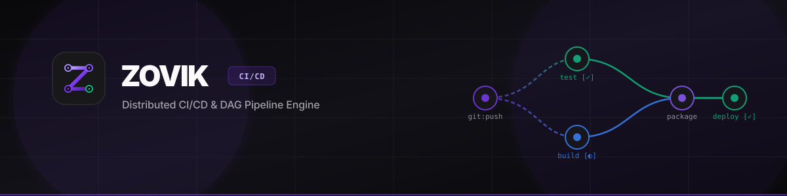
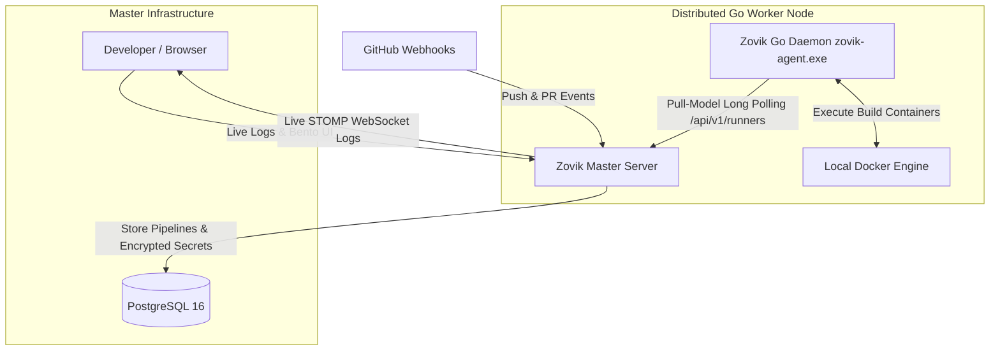

<p align="center">
  
</p>

<p align="center">
  <strong>⚡ High-Performance Distributed CI/CD &amp; DAG Pipeline Engine</strong>
</p>

<p align="center">
  
  
  
  
  
  
</p>

---

## 📖 Overview

**Zovik** is a modern, distributed, and lightweight open-source CI/CD system designed as a resource-efficient, self-hosted alternative to GitLab CI and Jenkins.

The system is built on a **Master-Agent DAG** architecture, allowing you to build, test, and deploy projects inside isolated Docker containers across local or distributed remote servers.

---

## 🚀 Key Features

* **Directed Acyclic Graph (DAG) Engine**: Declare dependencies between steps (`depends_on`), run independent stages in parallel, and benefit from cycle-free topological sorting.
* **Portable Go Runner (Pull-Model)**: ~15MB stateless Go runner daemon connecting via secure long-polling. No open inbound SSH ports required on worker machines.
* **Fullscreen Bento UI (Design System)**: Mathalama-inspired dark theme (`#09090B`, `#18181B`), interactive DAG visualizer, and live terminal streaming.
* **Docker-out-of-Docker (DooD)**: Steps execute within isolated container sandboxes with volume mounting and artifact extraction.
* **AES-256-GCM Secret Vault**: Multi-tenant encrypted storage for API keys, registry tokens, and SSH keys.
* **Live STOMP WebSockets Telemetry**: Real-time log line streaming without polling delays.
* **GitHub Integration**: Automated webhook triggers with HMAC-SHA256 signature verification and GitHub Commit Status reporting (`SUCCESS` / `FAILURE`).
* **JVM Virtual Threads (Project Loom)**: Spring Boot 4 running on Java 21 Virtual Threads with memory capped under 280MB RAM.

---

## 🏗 System Architecture



---

## ⚡️ Quick Start

### 1. Run full stack via Docker Compose:

```bash
docker compose -f deploy/docker-compose.yml up -d --build
```

Access the web control panel at **[http://localhost:3001](http://localhost:3001)**.

### 2. Connect a Go Runner Node:

```bash
# 1. Compile the agent
cd agents/go
go build -o zovik-agent.exe .

# 2. Register with one-time token from Web UI (Runners tab)
./zovik-agent.exe register --url http://localhost:3001 --token <REGISTRATION_TOKEN> --name worker-01

# 3. Start the daemon
./zovik-agent.exe run
```

---

## 📄 Pipeline Configuration Example (`.zovik.yml`)

Place `.zovik.yml` (or `.rabotyagaci.yml`) in the root of your Git repository:

```yaml
steps:
  - name: "Install dependencies and Build"
    dockerImage: "node:20-alpine"
    commands:
      - "npm install"
      - "npm run build"
    artifacts:
      - "dist/**"

  - name: "Run Unit Tests"
    dockerImage: "node:20-alpine"
    depends_on: ["Install dependencies and Build"]
    commands:
      - "npm test"

  - name: "Deploy to Production"
    dockerImage: "alpine:latest"
    depends_on: ["Run Unit Tests"]
    commands:
      - "echo 'Deploying artifact to server...'"
```

---

## 📜 License

This project is licensed under the MIT License.