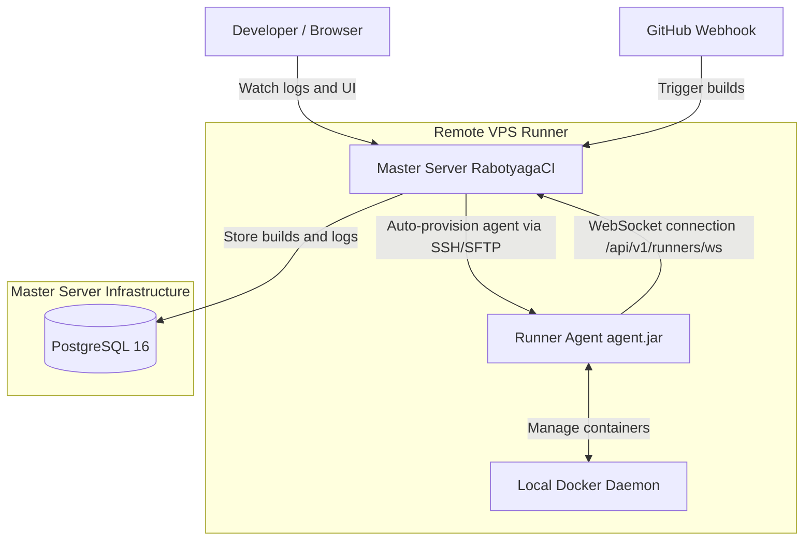

# RabotyagaCI

**RabotyagaCI** is a modern, distributed, and lightweight open-source CI/CD system designed as a resource-efficient alternative to heavy solutions like GitLab CI and Jenkins.

The system is built on a **Master-Agent (Master-Runner)** architecture, allowing you to automatically build, test, and deploy projects inside isolated Docker containers on remote servers.

---

## Key Features

* **Distributed Architecture (Master-Agent)**: Build orchestration is managed by the main Master server, while the execution of individual steps is delegated to remote lightweight agents (Runners) over a secure WebSocket connection.
* **1-Click Agent SSH Auto-Provisioning**: Adding a new build node is done directly from the Master admin panel. The system connects via SSH, installs required dependencies (Docker, Java), uploads the agent binary, and registers a systemd service.
* **Docker-out-of-Docker (DooD)**: Build steps execute within isolated Docker containers. Supports mounting the docker socket (`/var/run/docker.sock`) and privileged execution (`privileged: true`) to allow building Docker images inside step containers.
* **Security and Encryption**: All project secrets (passwords, SSH private keys) are stored in the database encrypted via the **AES-256-GCM** algorithm. Secrets are securely mounted to the runner with safe `600` POSIX file permissions.
* **Real-Time Logs**: Console outputs from Docker build containers on remote nodes are streamed in real time to the user's browser via WebSocket connections.
* **Artifact Management**: Automatic collection of build results (e.g., `.jar`, `.zip` archives) matching glob patterns, which are uploaded to the Master server via HTTP for persistent storage.
* **GitHub Integration**: Automatically triggers pipelines on Git push events (using signature-validated webhooks) and updates commit statuses via the GitHub Commit Status API (pending/success/failure).

---

## System Architecture



---

## Technology Stack

* **Master Backend**: Java 21, Spring Boot 4.1 (Virtual Threads / Project Loom), Spring Data JPA, Flyway (DB migrations).
* **Runner Agent**: Java 21 (Stateless CLI Application), Java-WebSocket, Docker-Java API client, JGit.
* **Database**: PostgreSQL 16.
* **Frontend**: Vue 3, Vite, Vue Router, Axios, SSE/WebSockets.
* **Proxy**: Nginx (used as Reverse Proxy and WebSocket Upgrader).

---

## Quick Start (Run full stack locally)

### Prerequisites
* Installed **Docker Desktop** or **Docker Engine** with Docker Compose.
* Installed **Java 21 JDK** and Gradle (for building from source).

### Startup Instructions

1. Clone the repository:
   ```bash
   git clone https://github.com/mathalama/custom-ci-server.git
   cd custom-ci-server
   ```

2. Build backend and agent JAR files:
   ```bash
   ./gradlew bootJar
   ```
   *(This task automatically compiles `agent.jar` and packages it into the Master backend's static resources for automatic provisioning).*

3. Run the container cluster via Docker Compose:
   ```bash
   docker compose up -d --build
   ```

4. Open the control panel in your browser:
   **http://localhost:3001**

---

## Pipeline Configuration Example (`.rabotyaga.yaml`)

Place this configuration file at the root of your repository:

```yaml
# Example pipeline configuration for a Node.js application
steps:
  - name: "Install dependencies and Build"
    dockerImage: "node:20-alpine"
    commands:
      - "npm install"
      - "npm run build"
    artifacts:
      - "dist/**" # Collect all files in the dist folder as build artifacts

  - name: "Build and Push Docker Image"
    dockerImage: "docker:stable"
    dockerSocket: true # Mount docker socket to build docker images
    privileged: true
    commands:
      - "docker build -t myapp:latest ."
      - "docker tag myapp:latest myregistry.com/myapp:latest"

  - name: "Deploy to Production"
    dockerImage: "alpine:latest"
    commands:
      - "apk add --no-cache ansible openssh-client"
      - "ansible-playbook -i hosts deploy.yml --private-key=.ssh/id_rsa"
    secretFiles:
      # Master decrypts the private key and writes it inside the container with 600 permissions
      .ssh/id_rsa: "PROD_SSH_KEY"
```

---

## Remote Agent Deployment (Runners)

1. Go to the **Runners** tab in the sidebar menu.
2. Click **Add Runner**.
3. Fill in the remote server credentials:
   * Host / IP address.
   * SSH Username (e.g., `root`).
   * SSH Port (default is 22).
   * SSH Private Key contents or Password.
4. Click **Deploy Runner**.
5. Click the **View Install Log** button on the newly added runner card to watch the deployment progress. Once provisioning finishes, the runner status turns **ONLINE** and it automatically starts accepting builds.

---

## License
This project is licensed under the MIT License. Developed as a graduation thesis project.